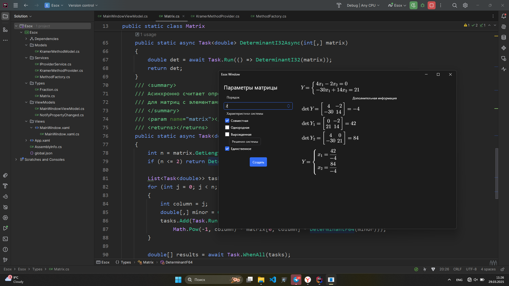
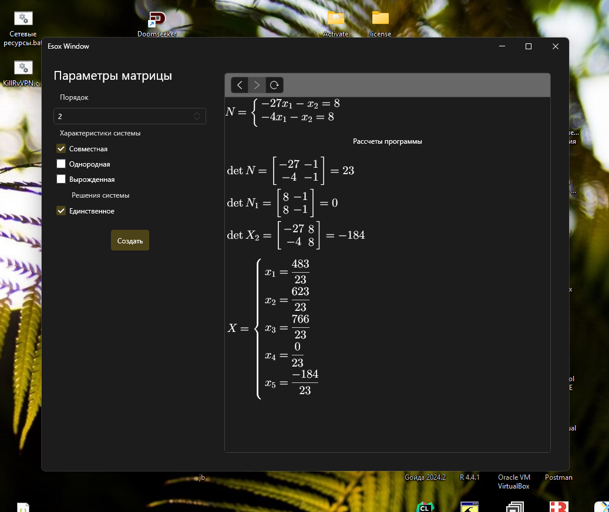
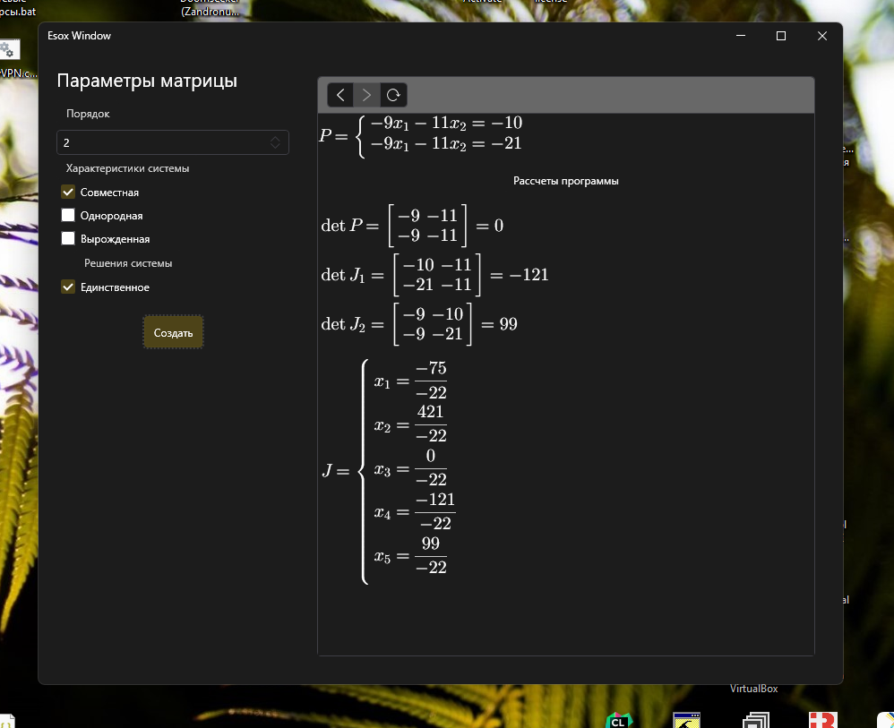

# О разделе
Спустя четыре дня работы над методами решения систем линейных уравнений, реализация, преобразованиями Крамера
был успешно доделан. Тестирование разметки, без учета
создания конечной системы линейных уравнений, содержащей
решения для каждого $x_i$, успешно завершено.
В последний четвертый день работы над методом Крамера,
во время динамических тестов были обнаружены следующие ужасы.

### Проблемы поменьше
Для метода Крамера, существует одна проблема,
которую пока что я не вижу смысла решать:

Не особо вглядываясь в ответ, можно дополнить решение тем,
что и числитель и знаменатель можно сократить. Возможно в будущем
я смогу реализовать и такую возможность, чтобы видеть одинаковые
составляющие числителя и знаменателя дроби.

## Проблемы побольше

### Решений системы больше, чем элементов столбца
Ведутся работы по устранению такого рода чудовищ

### Решения для вырожденной матрицы оказывается существуют
Заодно ведутся работы по отладке и устранению
моих логических ошибок при формировании разметки.
Подозреваю, что именно там "собака зарыта"

