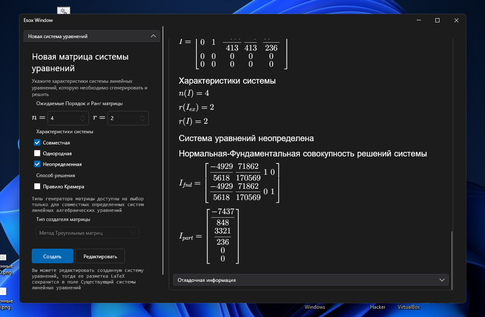

# Esox-math
Esox генерирует и решает системы линейных алгебраических
уравнений любого порядка (от 2 до 20). Поддерживает
системные цвета, если операционная система - Windows 10 и выше.

### Снимки экрана
Акцент и темная тема:

Акцент и светлая тема

### [Описание алгоритмов](INSIDE.md)
Постепенно будет описываться в [здесь](INSIDE.md), или переедет в новый каталог
с численными методами.

### Режимы работы
Приложение способно как создавать и решать системы линейных уравнений, так и решать уже установленную расширенную
матрицу системы. С обновления `1.2.0.0` добавлены два
раздела параметров для новой матрицы системы и для существующей
матрицы системы.

На снимке экрана выше представлено составление фундаментальной
совокупности решений для новой (сгенерированной) матрицы
коэффициентов.

На данном снимке экрана представлен ход решения для
существующей матрицы системы (заданной вручную, используя `LaTeX` окружения).

> На момент обновления `README` использование комманды `\pmatrix`
при десериализации не включено, поэтому матрицу системы следует задавать
явными блоками окружения `\begin{...}` и `\end{...}`

# Используется
 - [WpfMath](https://github.com/nevgeny/wpf-math) - Элемент управления окна для WPF приложений, который рисует разметку `LaTeX`
 - [HandyControl](https://github.com/HandyOrg/HandyControl) - Огромная библиотека элементов управления
 и расширение возможностей для использования MVVM принципов.
 - .NET 6.0,
 - C# 10

### Источники, найденные во время изучения вопроса, выложены в репозитории или будут выложены в репозитории позже. 
