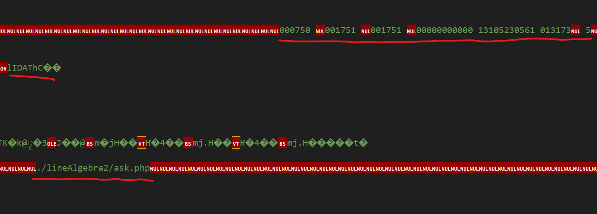

# linearAlgebra

Серверная часть написанная на PHP попала ко мне в руки
от людей с кафедры и пренадлежит совершенно другому человеку.
Этой работе очень много лет и она стала источником вдохновения
написать `Esox-Math` самому. После релиза 1.2.0.0 она попала ко мне
в руки с разрешением на публикацию.

Возможно в сердце Esox-Math будут позаимствованы идеи
и алгоритмы из этой работы. 

### Исходный материал
_Не Содержит_ двоичное представление и какие-то 
zero-filled блоки. Поскольку в архитектуре `php`
я не разбираюсь, могу лишь предположить, что
может быть внутри блоков.

Такие блоки были закомментированны а потом вовсе удалены,
потому что ~субъективно~ они содержат сводку о том
какие файлы и какие функции были в каких файлах/каталогах
и какие endpoint'ы регистрировались.